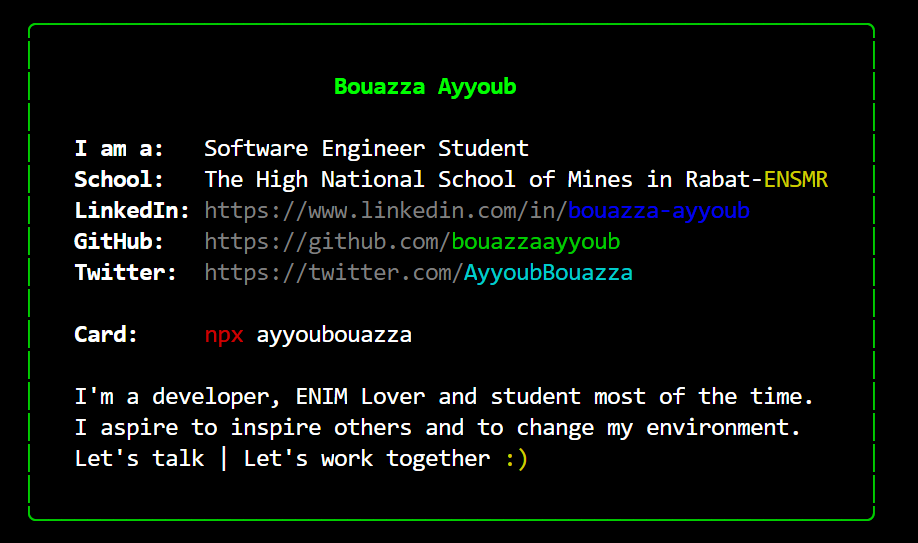

<h2>It's me, Bouazza Ayyoub!</h2>
<p><em>Software Engineer Student at ENSMR
</em></p>

> Software engineer | Technologies Lover | Hyperlooper

---

A little more about me... with npm installed, just type

```
npx ayyoubouazza
```



**Skills:**

<code></code>
<code></code>
<code></code>
<code></code>
<code></code>
<code></code>


